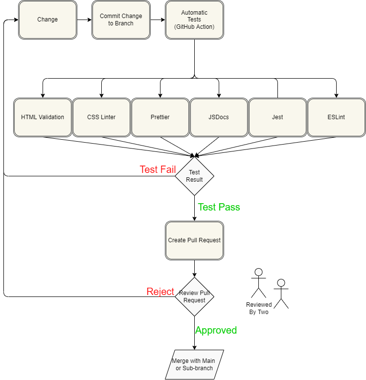

# Phase 2 Status Update On CI/CD Pipeline

For our CI/CD pipelines, we have used automated actions on GitHub as a tool to maintain our code.
We are currently utilizing six HitHub actions, HTML
Validation for validating our front-end pages, ESLint for our JS pages,
in addition to Jest for Unit Testing, CSSLint for our CSS styles. We
are also using JSDocs to generate documentation. We hope to automatically
deploy those pages to GitHub pages when that is fully implemented. Lastly,
we are using 

## Diagram

## Status of Each Part

* HTML Validation - Implemented on testing branch
* ESLint - Implemented on testing branch
* Jest - Implemented on testing branch
* CSSLint - Implemented on testing branch
* JSDocs - Implemented on testing branch, [bug] unable to publish to github pages.
* Prettier - Implemented on testing branch

## Next Steps
* Fix JSDocs bug
* Merge the Pipeline with main so everyone 
  can start pushing/merging code and have it pass tests
