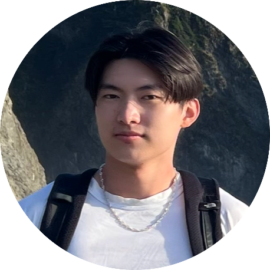

<!-- Your team page should have the team name, brand, any values you think are important, and a roster of all the team members.  The roster should provide a brief overview of each member with a link to their personal Github page.  The team page can include humor or whatever culture makes sense to your team, but keep it reasonable as it may be shown to others. -->

#### Our Values

At Wing It, our core values are communication, collaboration, and hard work. As a team, we strive to remain curious while insisting on the highest standards for every project we build.

#### Meet The Team

[Supratik Banerjee](https://github.com/awesomesup)  
Hello! I am Sup and I am one of the group leaders for Wing It (Team 6). I am a senior Math-CS Student at UCSD and plan to join the software engineering industry after graduation. My long-term career goals is to ~~become a Pokémon master~~ focus on Neural Network related research.

 

[JC Yan](https://github.com/ahhorse1) 
Hi I'm JC, one of the group leads for Wing It. I am a second year Computer Science major. I like planes, a lot. While I hope to continue in the CS field, I also hope to become a pilot.

 

[Tyler Le](https://github.com/tyler-le)  
Hello, I'm Tyler and I am a junior CS student at the University of California San Diego. My hobbies include surfing, working on cars, and riding my motorcycle. In terms of my career, I am planning on joining the robotics industry.

 

 [Michael Lian](https://github.com/michaelliann) 
Hi! My name is Michael Lian and I am currently a third year Math-CS student at UCSD on team 6. Some hobbies I enjoy outside of class are cooking, lifting, and dancing. I am planning on going to the industry after graduation to become a software engineer.

 

[Andrei Secor](https://github.com/andreijsecor)  
Hi, I'm Andrei Secor, and I'm a third year majoring in Math - Computer Science and Computer Engineering. In the future, I hope to work somewhere in software engineering, though I'm still not sure what exactly I want to do yet, since one of the most important things in a job, for me, is the amount I'm able to learn from it.

 

[Christian Antonio-Hernandez](https://github.com/CristianAH)

 

[Jongmin Kim](https://github.com/JongminKim292) 
Hi I am Jongmin and I’m member for Wing It (group 6). I’m 4th year CS Student. I’m interested in iOS mobile application developer. I’m currently working on reward app as my side project.

 

[Kwangyun Keum](https://github.com/Kwangyun) 
Hello! I am Kwangyun Keum, a senior Math-CS Student at UCSD and plan to become a software engineer. My goal is to become a penetration tester in the cyber security area.

 

[Matilda Michel](https://github.com/mhm1117)  
Hi Everyone! I'm Matilda and I'm a Cog Sci Machine Learning Major (and CSE Minor) on my last quarter here! For this project, I'm planning to step out of my comfort zone and try my hand at frontend and design work. I’m not even sure I’m going to go into the software engineering field but I love creating and trying new things!

 

[Tamara Sagakova](https://github.com/tamarasagakova)  
Hey! I am Tamara and I am a member of Wing It (group 6). I am a 4th year studying Computer Science at UCSD. I am interested in software engineering and Artificial Intelligence, so in the future I hope to work in one of those fields (if not in both).
